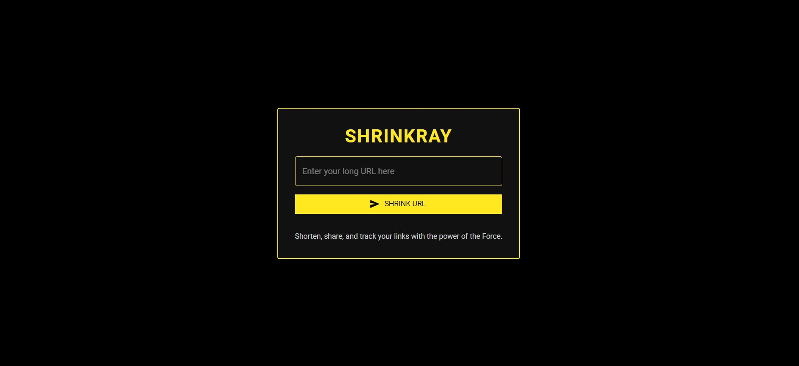
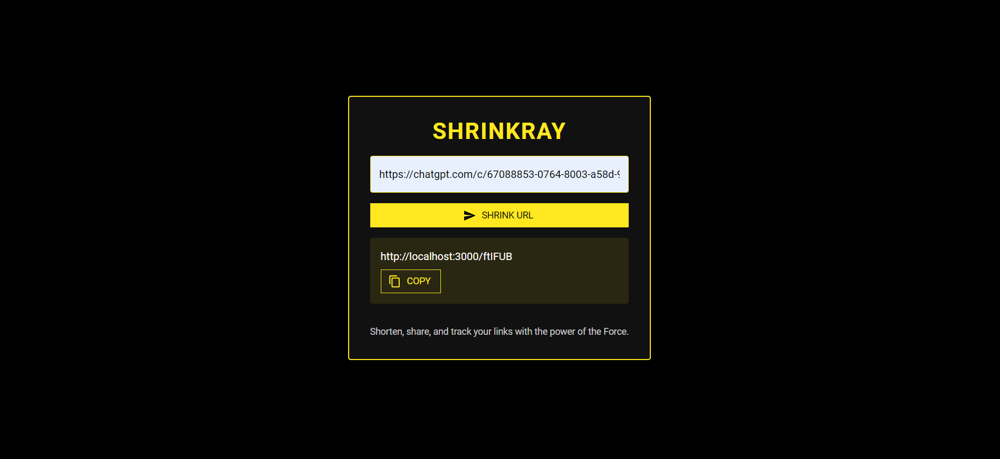
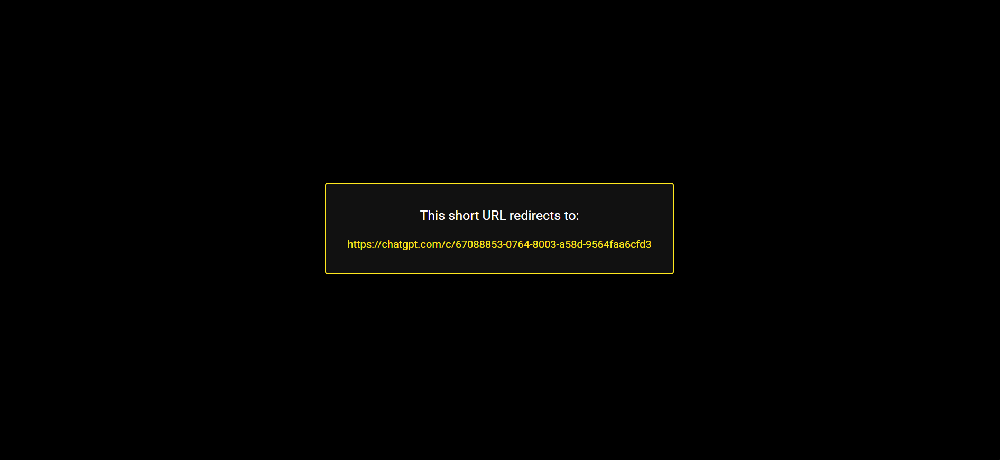

# ShrinkRay: Bringing URL reduction to galactic proportions!

ShrinkRay is a simple and efficient URL shortener service built with Go and React.js. It allows users to create short, easy-to-share URLs that redirect to longer, original URLs.

## Features

- Create short URLs from long ones
- Redirect short URLs to their original destinations
- Fast and efficient backend using Go, with Redis for caching
- MongoDB for persistent storage
- Modern, responsive frontend built with React.js

## Screenshots

Here are some screenshots of the ShrinkRay application:

### Home Page


_The main page where users can enter long URLs to be shortened._

### Results Page


_Displays the shortened URL after processing._

### Redirection page _ include '\_' in shortcode to see this _


_Redirection warning page._

## Prerequisites

Before you begin, ensure you have met the following requirements:

- Go 1.20
- Node.js 14.x or higher (for frontend)
- Redis server
- MongoDB server
- Git (for cloning the repository)

## Installation

### Backend

1. Clone the repository:

   ```
   git clone https://github.com/Avon11/ShrinkRay.git
   ```

2. Navigate to the backend directory:

   ```
   cd ShrinkRay/backend
   ```

3. Install Go dependencies:

   ```
   go mod tidy
   ```

4. Set up your environment variables (see Configuration section below)

5. Build the project:
   ```
   go build
   ```

### Frontend

1. Navigate to the frontend directory:

   ```
   cd ../frontend
   ```

2. Install Node.js dependencies:

   ```
   npm install
   ```

## Configuration

### Backend

Create a `.env` file in the root of the backend directory with the following variables:

```
MONGO_URI=mongodb://your_mongodb_uri
REDIS_ADDR=localhost:6379
REDIS_PASSWORD=your_redis_password
REDIS_DB=0
```

Adjust these values according to your Redis and MongoDB configurations.

## Usage

### Running the Backend

To start the backend server, run:

```
cd backend
go run cmd/main.go
```

The server will start on `http://localhost:8080` by default.

### Running the Frontend

To start the frontend development server, run:

```
cd frontend
npm start
```

The React app will start on `http://localhost:3000` by default.

### API Endpoints

1. Create a short URL

   - Endpoint: `POST /post-url`
   - Request body:
     ```json
     {
       "url": "https://example.com/very/long/url/that/needs/shortening"
     }
     ```
   - Response:
     ```json
     {
       "code": 200,
       "msg": "success",
       "model": {
         "url": "https://ShrinkRay.com/06SWjw"
       }
     }
     ```

2. Redirect to original URL

   - Endpoint: `GET /get-url?code=abc123`
   - Response: Get redirect url with code `200`
     ```json
     {
       "code": 200,
       "msg": "success",
       "model": {
         "shortCode": "06SWjw",
         "url": "https://github.com/Avon11/User-management/blob/main/main.go"
       }
     }
     ```

3. Check original URL before redirecting - Add `_` at end of shortcode
   - Endpoint: `GET /get-url?code=abc123_`
   - Response: Get redirect url with code `201`
     ```json
     {
       "code": 201,
       "msg": "success",
       "model": {
         "shortCode": "06SWjw",
         "url": "https://github.com/Avon11/User-management/blob/main/main.go"
       }
     }
     ```

## Frontend Features

- User-friendly interface for URL shortening
- Display of shortened URLs with copy-to-clipboard functionality
- Responsive design for mobile and desktop use

## Future Improvements

1. QR code generation
2. Link expiration and Self destruct
3. User authentication and personalized URL management
4. Analytics dashboard for shortened URL usage

## Acknowledgements

- [Gin Web Framework](https://github.com/gin-gonic/gin)
- [Go-Redis](https://github.com/go-redis/redis)
- [MongoDB Go Driver](https://github.com/mongodb/mongo-go-driver)
- [React.js](https://reactjs.org/)
- [Create React App](https://create-react-app.dev/)
